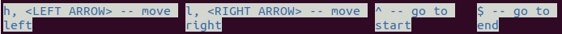

# ink-use-input-hints

A facade for [ink](https://github.com/vadimdemedes/ink) [`useInput`](https://github.com/vadimdemedes/ink#useinputinputhandler-options) hook using a builder API and adding helpers for generating the hint bar.

## Installation 

    npm install ink-use-input-hints

## Quick start example

_App.js_
```javascript
const { InputHints } = require('ink-use-input-hints');
const App = () => (
    <InputHints>
        <SubComponent/>
    </InputHints>
)
```
_SubComponent.js_    
```javascript
const { useInputWithHints } = require('ink-use-input-hints');
const SubComponent = () => {     
    useInputWithHints((handler, { KEYS }) => handler
            .add([KEYS.leftArrow, 'h'], () => {
                // handle movement left
            }, {description: 'move left'})
            .add([KEYS.rightArrow, 'l'], () => {
                // handle movement right
            }, {description: 'move right'})
            .add(['^'], () => {
                // handle going to start
            }, {description: 'go to start'})
            .add(['$'], () => {
                // handle going to end
            }, {description: 'go to end'})
            .add([KEYS.return], () => {
                // submit, wont be shown in hint bar
            }) 
    );
    return (<></>)
}
```

Bottom of App should show the bar with the keyboard hints:



## Background
I enjoy Ink very much and find myself reusing the hint bar again and again, so I've decided to extract it out.
I found the builder API more intuitive for reuse (for example, having the same keys do similar things across different screens). 

## API

Module exports the following members: 

#### config
A [map](https://developer.mozilla.org/en-US/docs/Web/JavaScript/Reference/Global_Objects/Map) with parameters configuring the library behaviour; the keys of interest are: 
    
- `AUTO_UPDATE_HINTS` - _default: true_ When set to true, list of hints (`hints` array of [InputHintsContext](#InputHintsContext)) will be automatically updated each time `useInputWithHints` is called.
- `KEY_FORMATTER_FN` - a function which accepts an object `{index, key}` and returns a string. This is used to format the key description part of the hint.
  
    For example, in the above screenshot, hint for handling `[KEYS.leftArrow, 'h']` is displayed as "h, <LEFT_ARROW> -- move left". Let's say we change this:
    ```Javascript
        config.set('KEY_FORMATTER_FN', ({index, key}) => `${key} (${index+1})`)
  ``` 
    Now, the hint for handling `[KEYS.leftArrow, 'h']` would be displayed as "h (0), leftArrow (1) -- move left". 
- `HINT_FORMATTER_FN` - a function which accepts an object `{index, formattedKeyDescriptions, description}` and returns a string. This governs how the individual hint text is generated from the list of keys and it's description. `index` is the index of the hint. `formattedKeyDescriptions` is an array of strings representing key descriptions (as returned by `KEY_FORMATTER_FN`). `description` is a description text provided in `useInputWithHints` handler. The default value (generating the output in the above example) looks like this:
    ```javascript
    config.set('HINT_FORMATTER_FN', ({
      index,
      formattedKeyDescriptions,
      description
    }) => {
      const sortedByLength = sortBy(formattedKeyDescriptions, desc => desc.length);
      const keyList = sortedByLength.join(', ');
      return `${keyList} -- ${description}`;
    });
    ```

#### InputHintsContext

A react [context](https://reactjs.org/docs/context.html) for sharing data (hints) between the `useInputWithHints` hook and the components displaying them (such as [HintBar](#HintBar)).
If you want to manually manage the hints, you can use this.

```javascript
const { InputHintsContext } = require('ink-use-input-hints');
// ...
const inputHintsContext = useContext(InputHintsContext);
inputHintsContext.setHints(['my','custom','hints']);
inputHintsContext.hints // array containing ['my','custom','hints']
```
#### InputHintsContextProvider

[Provider](https://reactjs.org/docs/context.html#contextprovider) for  [`InputHintsContext`](#InputHintsContext). Provides `hints` and `setHints`. Already contained in [`InputHints`](#InputHints).

#### useInputWithHints

Hook for handling user input and adding movement hints. Similar to [`useInput`](https://github.com/vadimdemedes/ink#useinputinputhandler-options).

`const hints = useInputWithHints(definerFunction)`;

To define how the user input is handled, you pass in `definerFunction`, which will be provided with two objects - 
`handler` and `options`, i.e. `definerFunction(handlersBuilder, options)`;

`handlersBuilder` has a single method `add`, which accepts three arguments:

`
handlersBuilder.add(keyList, handler, additionalOptions)
`

  - `keyList` - array of inputs for which the `handler` should be triggered. Each element is either a single character, or a string representing a "special" key ('return', 'ctrl', 'leftArrow'.. ) The list matches the possible key names of [the second argument to the original useInput](https://github.com/vadimdemedes/ink#key). All of the values are accessible via the [KEYS](#KEYS) object. 
  - `handler` - this is called when user presses one of the keys in `keyList`, like the [inputHandler](https://github.com/vadimdemedes/ink#useinputinputhandler-options) for `useInput`.
  - `additionalOptions` - object containing a single key, `description` - used for generating hints. If it's not provided, a hint for this `keyList` won't be generated 
  
The `options` argument to `definerFunction` has a single key, [`KEYS`](#KEYS), which is an object listing all the recognizable special keys. 

Finally, `useInputWithHints` returns an array listing generated hints.

```javascript
const hints = useInputWithHints((handler, { KEYS }) => handler
          .add([KEYS.return, 'C'], () => {
              console.log('Submit!');
              submitInfo();
          }, {description: 'Submits the form'})
);
// hints === ['C, <RETURN> -- Submits the form']
// when user presses <RETURN> or C, the method submitInfo is called
```
#### KEYS

Contains all of the recognizable special keys:
```javascript
const KEYS = {
  upArrow: 'upArrow',
  downArrow: 'downArrow',
  leftArrow: 'leftArrow',
  rightArrow: 'rightArrow',
  pageDown: 'pageDown',
  pageUp: 'pageUp',
  return: 'return',
  escape: 'escape',
  ctrl: 'ctrl',
  shift: 'shift',
  tab: 'tab',
  backspace: 'backspace',
  delete: 'delete',
  meta: 'meta'
}  
```

#### InputHints

A component which wraps all the children in [`InputHintsContextProvider`](#InputHintsContextProvider) and draws the [`<HintBar/>`](#HintBar) below them. 
Can be passed an object (`{wrapperProps: {..}, itemWrapperProps: {..}, textProps: {..}}`) specifying how the hintBar is drawn.

```javascript
<InputHints hintBarProps={{
    textProps: {backgroundColor: 'black', color: 'white'}
}}>
    ...
</InputHints>

```

#### HintBar
Default component for drawing default bar with hints. Accepts the following attributes:

  - `hints` - array of hints. If not provided, it will use [InputHintsContextProvider](#InputHintsContextProvider)
  - `wrapperProps` - object containing attributes for styling the Ink [Box](https://github.com/vadimdemedes/ink#box) containing the hint bar
  - `itemWrapperProps` - object containing attributes for styling the [Box](https://github.com/vadimdemedes/ink#box) wrapping the individual hint
  - `textProps` - object containing attributes for styling the text display of an individual hint. Ink's [Text](https://github.com/vadimdemedes/ink#text) component is used for this, so attributes are the same.

## Development

Currently, this is good enough for my use case - of course, suggestions and improvements are welcome.

## LICENSE

[MIT](LICENSE)
